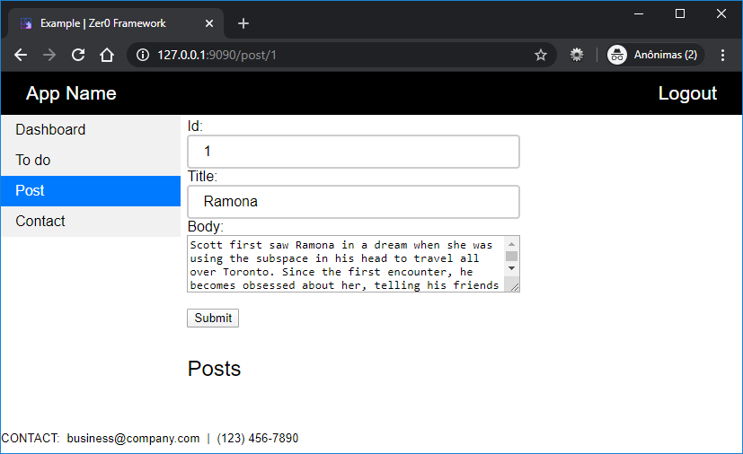

# zer0framework

There is only one rule here, frameworks or libraries should not be used for development, the intention is not to make everything more laborious, but for you to understand the concepts, thus being limited only to the resources of the languages.

# Server (backend)

To start the backend service, enter the app-server folder and run the command:

```
mvn jetty:run
```

# Webclient (frontend)

To start the frontend using a httpservice, enter the app-webclient folder and run the command:

```
live-server --port=9090
``` 

Navigate to http://localhost:9090/:



(*) If you don't have live-server installed, you can install it with the command below, or use another http server.
```
npm install -g live-server
```